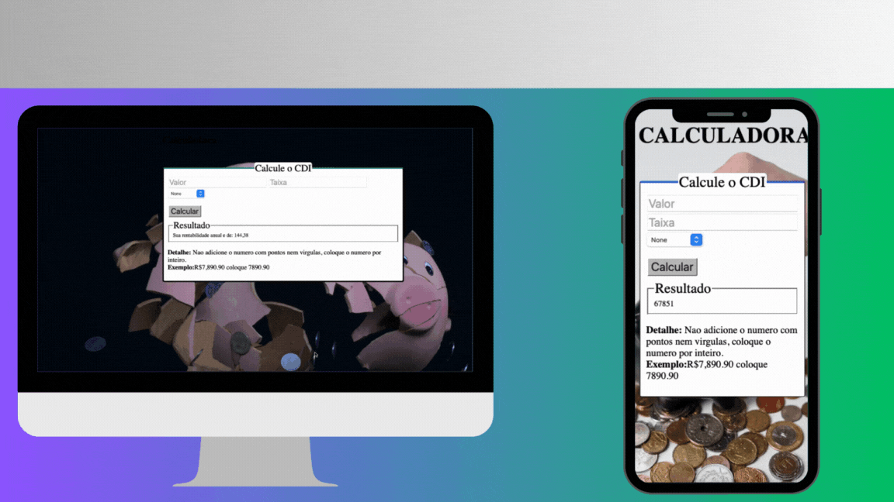

# Pacote de aplicativos criado com PHP

Nessa pasta contem diversos aplicativos que foram criados do absoluto zero, muitos deles e de uso proprio que contem grande utilidade publica, como a calculadora para investimentos. Fique a vontade caso queira contribuir com esse projeto

## Pré-requisitos


* PHP 7 ou superior instalado no sistema.
* Extensão curl habilitada.
* Ter um aplicativo de execução de codigo

## Utilizando 

Clone essa pasta no seu editor de codigo, pode ser vscode ou qualquer outro, no seu terminal "linha de comando" digite os seguintes codigos:


Acesse o diretório do projeto:

```bash
cd "pasta que deseja acessar"
```
Logo apos depois de acessar a pasta do aplicativo, digite para rodar o aplicativo

```bash
php -S localhost:3000;
```

Voce pode fazer essa pajrte utilizando imagem docker ou apache, aqui estou rodando localmente.

## Outras pastas 

Para acessar aplicativos de execução via terminal um exemplo e o aplicativo de conversão de moeda, que e executado via terminal, siga os seguintes passos. 

### Cotação

Abra o seu terminal do repositorio clonado e digite os seguintes comandos: 

* Para consultar a cotação
```bash
 php cotacao.php USD BRL
```

* Para ver o fechamento

```bash
 php fechamento.php USD BRL
```

## Demostração dos aplicativos no front-end


<div style="max-width: 100%; overflow: hidden;">
    
</div>
<br>
<hr>
<div style="max-width: 100%; overflow: hidden;">
    
</div>


## Tech Stack

**Tecnologias:** JavaScript, PHP, CSS, HTML

**Server:** Apache, Docker, PHP


## License

[MIT](https://choosealicense.com/licenses/mit/)


## Instalação do PHP

Recomendo que veja essa parte no youtube, caso não tenha php instalado. Porem segue o comando para installar ele 

```bash
sudo apt-get install php

```
Verifique se o PHP foi instalado corretamente digitando o comando "php -v" e pressionando Enter. Isso deve exibir a versão do PHP instalada.

## 🛠 Skills
Javascript, HTML, CSS, PHP, docker, xampp


## 🚀 About Me

Olá é um prazer me apresentar a vocês meu nome é Bruno Oliveira. Atuo como engenheiro de software a mais de 3 anos e web designer ha mais de 5 anos por meio de projetos voluntários, possuo experiência em diversas linguagens de programação. Estou cursando bacharelado em engenharia da computação na faculdade UNIFRAN, uma das maiores da América do Sul, me formei em introdução à ciência da computação na Edex uma plataforma do MIT junto com Harvard, estou divulgando meus projetos no meu Instagram e GitHub diariamente contribuindo para evolução tecnológica que amo.

E o mais importante e que faço isso porque amo de coração e alma. 🚀🤍

## Authors

- [@devbrunoo](https://www.github.com/DevBrunoo)


## Redes sociais


   <a href="https://www.instagram.com/devbrunoo/" target="_blank"></a>
    <a href="https://medium.com/@devbrunoo" target="_blank"></a> 
    <a href="https://www.quora.com/profile/DevBrunoo" target="_blank"></a>
   <a href="https://codepen.io/brunobyhow15" target="_blank"></a> 
    <a href = "mailto:contactbruno5@gmail.com"></a>
    <a href="https://www.linkedin.com/in/devbruono/" target="_blank"></a> 
  
